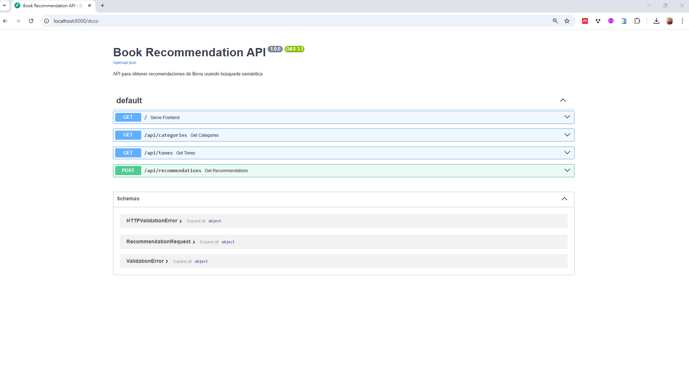

## 📚 Trabajo Final - Sistema de Recomendación Inteligente de Libros con LLM


**Autor:** Alexander Chavez Cabana  
**Diploma AI Engineer - Edición 3 (Octubre 2025)**  
**Curso:** Agentes Inteligentes y Sistemas de Recomendación Adaptativos  
**Docente:** Ernesto Laura  


---

## 🎯 Descripción General

Este proyecto es el trabajo final para el curso "Agentes Inteligentes y Sistemas de Recomendación Adaptativos" y consiste en el desarrollo de un sistema inteligente de recomendación de libros, integrando técnicas modernas de inteligencia artificial y procesamiento de lenguaje natural.

### Objetivo del Caso

Desarrollar una solución capaz de recomendar libros personalizados a partir de una consulta en lenguaje natural, una categoría y un tono emocional deseado, utilizando modelos de lenguaje de última generación y una arquitectura API profesional.

### Características principales

- **Búsqueda Semántica Vectorial:** Utiliza *embeddings* generados con Google Gemini para encontrar similitud semántica entre la consulta del usuario y las descripciones de los libros.
- **Análisis de Emociones:** Detecta 7 emociones principales en las descripciones de los libros mediante modelos de NLP.
- **Clasificación de Textos:** Clasifica automáticamente los libros en categorías simples usando Zero-Shot Learning con el modelo BART.
- **API RESTful con FastAPI:** Permite el consumo de recomendaciones desde cualquier cliente (web, móvil, escritorio) y expone endpoints claros y documentados.
- **Frontend Web:** Interfaz simple para probar el sistema de recomendación desde el navegador.

El sistema procesa aproximadamente 2,000 libros del dataset público de Kaggle (7k-books-with-metadata) y permite encontrar recomendaciones personalizadas basadas en:

- 📝 Consulta en lenguaje natural (`query`)
- 📂 Categoría de libro (`category`)
- 😊 Tono emocional deseado (`tone`)

Este trabajo integra conceptos de agentes inteligentes, sistemas de recomendación, procesamiento de lenguaje natural y despliegue de APIs modernas, demostrando competencias clave del perfil AI Engineer.

---

## 📋 Tabla de Contenidos

1. [Instalación](#instalación)
2. [Estructura del Proyecto](#estructura-del-proyecto)
3. [Notebooks Disponibles](#notebooks-disponibles)
4. [Uso de la API REST](#uso-de-la-api-rest)
5. [Arquitectura del Sistema](#arquitectura-del-sistema)
6. [Tecnologías Utilizadas](#tecnologías-utilizadas)
7. [Configuración de Variables de Entorno](#configuración-de-variables-de-entorno)
8. [Ejecución Paso a Paso](#ejecución-paso-a-paso)

---


## 🔧 Instalación

### 1. Clona el repositorio desde GitHub

```bash
git clone https://github.com/tu-usuario/proyecto-alexander-chavez-cabana.git
cd proyecto-alexander-chavez-cabana
```

O descarga y descomprime el proyecto manualmente si lo prefieres.

### 2. Crea un entorno virtual (opcional pero recomendado)

**Windows (PowerShell):**

```powershell
python -m venv venv
.\venv\Scripts\Activate.ps1
```

**macOS/Linux:**

```bash
python3 -m venv venv
source venv/bin/activate
```

### 3. Instala las dependencias

```bash
pip install -r requirements.txt
```

**Si tienes GPU NVIDIA (CUDA):**

```bash
pip install torch torchvision torchaudio --index-url https://download.pytorch.org/whl/cu118
```

**Si tienes Apple Silicon (MPS):**

```bash
pip install torch torchvision torchaudio
```

### 4. Configura las variables de entorno

Crea un archivo `.env` en la raíz del proyecto:

```env
GOOGLE_API_KEY=tu_clave_api_aqui
```

---

### 5. Ejecuta el servidor FastAPI

```bash
python main.py
```

El servidor estará disponible en [http://localhost:8000](http://localhost:8000).

- Interfaz web: [http://localhost:8000](http://localhost:8000)
- Documentación API (Swagger UI): [http://localhost:8000/docs](http://localhost:8000/docs)

---

## 🗂️ Estructura del Proyecto

```text
proyecto-alexander-chavez-cabana/
│
├── data/
│   ├── books_cleaned.csv
│   ├── books_with_categories.csv
│   ├── books_with_emotions.csv
│   └── tagged_description.txt
│
├── frontend/
│   └── index.html
│
├── notebooks/
│   ├── exploracion-data.ipynb
│   ├── busqueda-vectorial.ipynb
│   ├── clasificacion-texto.ipynb
│   └── analisis-sentimiento.ipynb
│
├── main.py
├── requirements.txt
├── .env
└── README.md
```

---

## 📓 Notebooks Disponibles

1. **exploracion-data.ipynb** 🔍
  - Exploración, limpieza y preparación de datos.
  - Crea `books_cleaned.csv`.
2. **busqueda-vectorial.ipynb** 🔎
  - Búsqueda semántica con embeddings y ChromaDB.
3. **clasificacion-texto.ipynb** 📂
  - Clasificación de libros en categorías simples usando BART.
4. **analisis-sentimiento.ipynb** 😊
  - Detección de emociones en descripciones de libros con DistilRoBERTa.

---

## 🔌 Uso de la API REST

Una vez ejecutado el servidor (`python main.py`), los siguientes endpoints están disponibles:

| Método | Ruta                  | Descripción                                              |
|--------|-----------------------|----------------------------------------------------------|
| GET    | /                     | Sirve la página principal (index.html)                   |
| GET    | /api/categories       | Lista de categorías disponibles                          |
| GET    | /api/tones            | Lista de tonos emocionales disponibles                   |
| POST   | /api/recommendations  | Endpoint principal. Recibe la consulta y retorna libros  |

### Ejemplo de solicitud (POST /api/recommendations)

**Cuerpo de la solicitud:**

```json
{
  "query": "Una historia de amor prohibido en la época victoriana",
  "category": "Fiction",
  "tone": "Sad"
}
```

**Respuesta:**

Retorna un objeto con la consulta procesada y una lista de hasta 16 recomendaciones.

---

## 🏗️ Arquitectura del Sistema

1. El usuario envía consulta, categoría y tono a la API.
2. FastAPI utiliza Google Gemini Embeddings para vectorizar la consulta.
3. Se buscan 50 libros similares en la base de datos ChromaDB.
4. Se filtra por categoría y se ordena por la emoción deseada.
5. Se retornan los 16 mejores libros en formato JSON.

---

## 🛠️ Tecnologías Utilizadas

| Librería / Servicio      | Propósito                                         |
|-------------------------|---------------------------------------------------|
| FastAPI                 | Framework para la API RESTful                     |
| Uvicorn                 | Servidor ASGI para FastAPI                        |
| Google Gemini API       | Generación de embeddings                          |
| pandas, numpy           | Manipulación de datos                             |
| langchain, langchain-chroma | Orquestación de NLP y base de datos vectoriales |
| transformers, torch     | Modelos LLM (BART, DistilRoBERTa)                 |

---

## 🔐 Configuración de variables de entorno

1. Obtén tu clave API de Google Gemini en [Google AI Studio](https://aistudio.google.com/).
2. Crea el archivo `.env` en la raíz del proyecto:

```env
# Google Gemini API
GOOGLE_API_KEY=tu_clave_api_aqui
```

**IMPORTANTE:** Agrega `.env` a `.gitignore` para no versionar la clave.

---

## 🚀 Ejecución Paso a Paso

### Opción 1: Ejecutar todo desde cero

```bash
# 1. Activa el entorno virtual
# ...

# 2. Ejecuta los notebooks en orden para generar los archivos CSV finales
jupyter notebook exploracion-data.ipynb
jupyter notebook busqueda-vectorial.ipynb
jupyter notebook clasificacion-texto.ipynb
jupyter notebook analisis-sentimiento.ipynb

# 3. Inicia el servidor API
python main.py
```

### Opción 2: Usar datos preprocesados

Si ya existe `books_with_emotions.csv`:

```bash
python main.py
```
python -m venv venv
.\venv\Scripts\Activate.ps1

---

## 📷 Capturas del Sistema Desarrollado

En esta sección se presentan capturas de pantalla y ejemplos visuales del sistema de recomendación desarrollado.



### Ejemplo:


